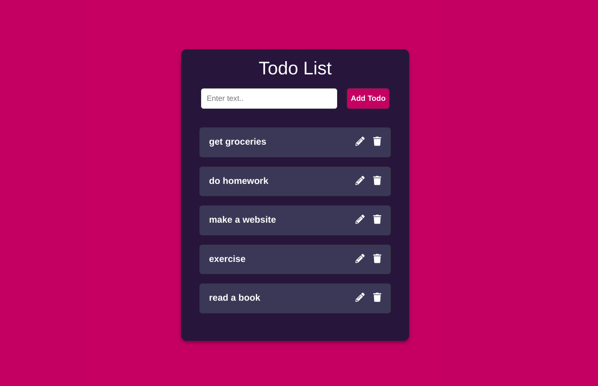

# Todo-List
This is a Todo List Application made using React. Modern React Hooks like useState, useEffect and useRef have been used.

# Features 
1. CRUD functionality implemented where users can add, list, update and delete todos for the todo list.

# Screenshot 

# Built with 
1. React Hooks 
